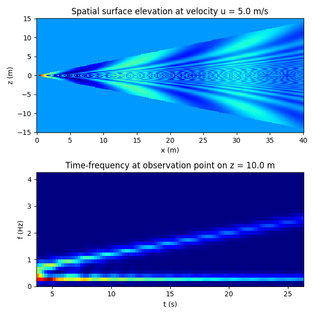

# models

A collection of numpy/scipy based models which were previously developed using Mathcad or Matlab, a work in progress.

## Kelvin Wake
[kelvinwake.py](kelvinwake.py) is an analytic model of the water waves generated by a point impulse moving at constant speed along a straight path. It was developed, by combining analysis from various texts, to enable identification and characterisation of river traffic events from water wave data. The script generates the spatial surface elevation field generated by an impulse moving at a specified velocity, and the time-frequency spectrogram of the wake observed at a specified distance.

